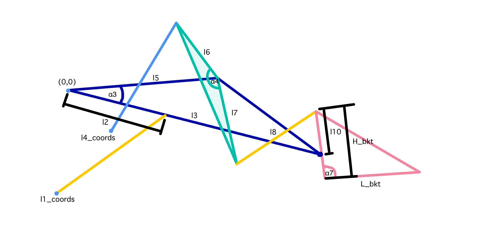

# Wheel Loader Trajectory & Kinematics

This project is a ROS2 package for wheel loader operations. It includes a kinematic solver, a trajectory generator, a state-based task manager for digging cycles, a visualization dashboard and a Gazebo simulation environment.

---

## Prerequisites
### System Requirements
- Ubuntu 22.04 LTS (Humble)
- ROS2 Humble
- Python 3.10+
- Gazebo Classic 11

---

## Installation
### Step 1: Clone Repository

```bash
mkdir -p loader_sim_pkg/src
cd loader_sim_pkg/src
cd loader_sim_pkg/src
git clone https://github.com/Ling-ling00/Wheel_Loader_Control.git .
cd ..
```

### Step 2: Install ROS Dependencies
```bash
sudo apt update
sudo apt install ros-humble-gazebo-ros-pkgs \
                 ros-humble-ros2-control \
                 ros-humble-ros2-controllers \
                 ros-humble-xacro \
                 ros-humble-tf-transformations
```
### Step 3: Install Python Dependencies

```bash
# Create virtual environment
python3 -m venv .venv
source .venv/bin/activate

# Install requirements
pip install -r requirements.txt
```

### Step 4: Build and Source
```bash
colcon build
source install/setup.bash
```

---

## Node Description
This system has 5 main nodes that work together.

### kinematics_node
The mathematical engine. It performs Forward Kinematics (FK) to track the bucket position and Inverse Kinematics (IK) to convert target tip velocities into cylinder speeds.

**Input**
| Topic Name | Type | Description |
| :--- | :--- | :--- |
| /loader_target_velocity | Float64MultiArray | Desired [vx, vy, v_theta] for the bucket tip. |
| /loader_current_position | Float64MultiArray | Feedback of actual cylinder lengths [lift, tilt]. |
| /local_loader_pose | Pose | Feedback of Loader Pose in Local Frame. (Reference from start Trajectory) |

**Output**
| Topic Name | Type | Description |
| :--- | :--- | :--- |
| /loader_joint_velocity | Float64MultiArray | Calculated target speeds for [v_lift, v_tilt, v_wheel]. |
| /loader_current_end_position| Float64MultiArray | Real-time tip position [x, y, theta] relative to start. |

### trajectory_generator
This node ensures that the loader moves smoothly between points without sudden jerks.
- Cubic Interpolation: When given a target waypoint, it generates a 3rd-order polynomial path. This ensures that the velocity starts at the current speed and ramps down to zero exactly at the target.
- Limit Enforcement: It constantly checks that the generated path does not exceed vmax (Max Velocity) or amax (Max Acceleration) defined in the parameters.
- Replanning: Every 0.5 seconds, it looks at the current error and re-calculates the remaining path to correct for any drift.

**Input**
| Topic Name | Type | Description |
| :--- | :--- | :--- |
| /loader_target_position | Float64MultiArray | A list of goal waypoints [x, y, theta] to visit. |
| /loader_current_end_position| Float64MultiArray | Current tip position use for calculate the distance remaining to the target. |

**Output**
| Topic Name | Type | Description |
| :--- | :--- | :--- |
| /loader_target_velocity | Float64MultiArray | High-frequency velocity commands sent to the Kinematics node. |

### state_generator
The state of the dig cycle. It processes LiDAR data to detect piles and calculates the optimal 4-point digging path.

**Input**
| Topic Name | Type | Description |
| :--- | :--- | :--- |
| /pile_cloud | PointCloud2 | LiDAR data used to detect the pile distance and slope. Including "x, y, z, slope_angle" data. |
| /loader_pose | Pose | The vehicle's current position in the global map. |
| /loader_current_end_position| Float64MultiArray | Current bucket position used as the starting point for plans. |

**Output**
| Topic Name | Type | Description |
| :--- | :--- | :--- |
| /loader_target_position | Float64MultiArray | The sequence of waypoints sent to the Trajectory Generator. |
| /local_loader_pose | Pose | Feedback of Loader Pose in Local Frame. (Reference from start Trajectory) |

### linkage_node
This node is a simulation for the loader. It's performs numerical integration and provides a high-fidelity visual dashboard of the entire physical assembly.

**Input**
| Topic Name | Type | Description |
| :--- | :--- | :--- |
| /loader_joint_velocity | Float64MultiArray | The target velocities for the lift/tilt cylinders and wheels. |
| /loader_current_end_position | Float64MultiArray | Feedback from the kinematics node used to plot the historical path trace. |

**Output**
| Topic Name | Type | Description |
| :--- | :--- | :--- |
| /forward_position_controller/commands | Float64MultiArray | Angular commands sent to Gazebo to move the virtual arm and bucket. |
| /velocity_controllers/commands | Float64MultiArray | Direct velocity commands for the Gazebo wheel drivers. |
| /loader_current_position | Float64MultiArray | The simulated "actual" cylinder lengths based on the physics integration. |

### loader_feedback_node
This node transform feedback topic from gazebo message ModelStates to geometry message Pose.

**Input**
| Topic Name | Type | Description |
| :--- | :--- | :--- |
| /gazebo/model_states | ModelStates | Gazebo Message Model Pose Feedback. |

**Output**
| Topic Name | Type | Description |
| :--- | :--- | :--- |
| /loader_pose | Pose | The vehicle's current position feedback in the global map. |

---

## Parameters
Configuration is managed in `config/params.yaml`.

**Mechanical & Linkage Geometry**

These parameters define the fixed physical dimensions and joint locations of the wheel loader.
|Parameter	|Type	|Default	|Description|
| :--- | :--- | :--- | :--- |
l1_coords, 	l4_coords|List	|(Various)	|[x, y] coordinates of the lift cylinder anchor and tilt cylinder anchor. |
l2, l3, l5-l10	|Float	|(Various)	|Linkage segment lengths (m). Describe in picture.|
L_bkt	|Float	|1.89815	|Horizontal length of the bucket.|
H_bkt	|Float	|0.77523	|Vertical height of the bucket.|
r	|Float	|1.0	|Radius of the loader wheels.|
alpha3, 4, 7_deg | Float | (Various) | Angle offset between linkage (degree). Describe in picture.|

image describe position of each linkage.


**Motion & Safety Limits**
Hard constraints to prevent mechanical damage and ensure smooth trajectory generation.

|Parameter	|Type	|Default	|Description|
| :--- | :--- | :--- | :--- |
|limit_lift	|List	|[1.66, 2.65]	|[min, max] stroke length (m) for the lift cylinder.|
|limit_tilt	|List	|[1.26, 1.84]	|[min, max] stroke length (m) for the tilt cylinder.|
|vmax	|List	|[0.3, 0.3, 0.7]	|Max allowable velocity for [X, Y, Theta].|
|amax	|List	|[0.1, 0.1, 0.3]	|Max allowable acceleration for [X, Y, Theta].|
|y_offset	|Float	|1.7932	|Distance from the arm pivot (0,0 in kinematic frame) to the floor level.|
|x_offset	|Float	|0.0	|Distance from the arm pivot (0,0 in kinematic frame) to center of wheel loader or base frame of wheel loader.|
|replan_period	|Float	|0.5	|How often the trajectory generator refreshes the path.|
|arrival_tolerance	|Float	|0.1	|Distance error (m) allowed before considering a waypoint reached.|
|dt	|Float	|0.02	|Global control loop period (default 50Hz).|

**Autonomous Dig Cycle (State Gen)**
Logic-based parameters that determine the shape and aggressiveness of the digging path.

|Parameter	|Type	|Default	|Description|
| :--- | :--- | :--- | :--- |
|bucket_width	|Float	|0.5	|Width of bucket for PointCloud filtering.|
|target_volume	|Float	|2.0	|Target material volume to excavate (m3).|
|safety_factor	|Float	|1.5	|Multiplier for the breakout volume calculation.|
|insert_length	|Float	|1.0	|Initial horizontal penetration distance into the pile.|
|max_insert_length	|Float	|3.0	|Maximum horizontal safety limit for digging.|
|max_height	|Float	|4.0	|Target Z-height for the final "Carry" state.|
|max_tilt_deg	|Float	|54.0	|Target rollback angle for bucket transport.|

---

## Usage
1. Launch the System

Load gazebo simulation using the launch file:
```bash
ros2 launch loader_sim_pkg loader_sim.launch.py
```

Load all nodes and parameters using the launch file:
```bash
ros2 launch loader_sim_pkg loader_trajectory.launch.py
```

**To simulate this node need input from volume estimate node which publish pile_cloud with `slope_angle` data**

2. Trigger Autonomous Digging

Once the loader is in front of a pile, trigger the state machine via service call:

```bash
ros2 service call /start_state std_srvs/srv/Trigger {}
```