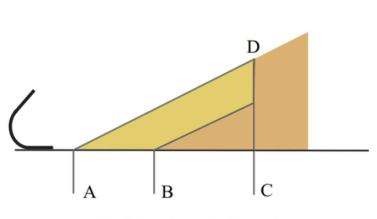
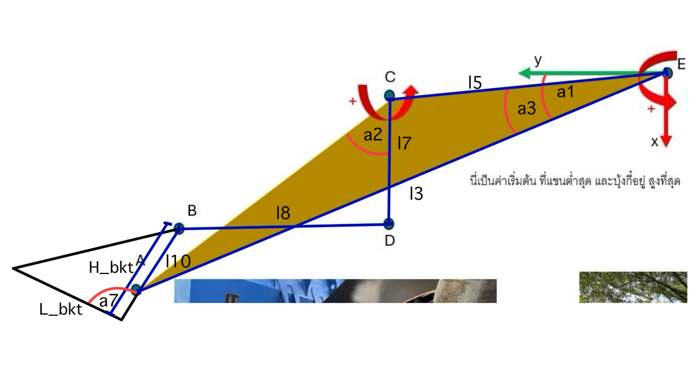

# Wheel Loader Trajectory & Kinematics Control

This ROS2 package simulates and controls autonomous wheel loader operations. It features a complete kinematic solver, a smooth cubic trajectory generator, a state-based task manager for digging cycles, a visualization dashboard, and integration with a Gazebo simulation environment.

---

## System Requirements
* **OS:** Ubuntu 22.04 LTS
* **ROS2 Distribution:** Humble Hawksbill
* **Python:** 3.10+
* **Simulation:** Gazebo Classic 11

---

## Installation

We provide an automated installation script `install.sh` that sets up all APT and Python dependencies, sets up the virtual environment, and builds the workspace.

### Step 1: Create Workspace and Clone Repository
```bash
mkdir -p loader_sim_pkg/src
cd loader_sim_pkg/src
git clone https://github.com/Ling-ling00/Wheel_Loader_Control.git .
```

### Step 2: Run the Setup Script
Make the script executable and execute it. It will build the workspace automatically:
```bash
chmod +x install.sh
./install.sh
```

### Step 3: Source the Workspace
Always activate your Python virtual environment and source the ROS2 workspace setup:
```bash
# Go to the workspace directory
cd ..
source .venv/bin/activate
source install/setup.bash
```

---

## Updating the Codebase

To pull the latest updates, overwrite local files (force pull), and rebuild the workspace:

```bash
# Navigate to the repository folder
cd loader_sim_pkg/src

# Fetch and force pull/reset to remote main branch
git fetch origin
git reset --hard origin/main

# Return to workspace root, activate virtual environment, and rebuild
cd ..
source .venv/bin/activate
colcon build
source install/setup.bash
```

> [!WARNING]
> Performing a `git reset --hard` will overwrite any local/custom modifications (such as custom changes in `config/params2.yaml` or node scripts). Ensure you back up your custom changes beforehand and re-apply them after updating.

---

## Nodes & Topics

The system consists of five main nodes working together:

### 1. `kinematics_node`
The mathematical engine of the loader. Performs:
* **Forward Kinematics (FK):** Calculates the real-time Cartesian position and pitch of the bucket tip using the input lift and tilt joint angles (from `/loader_current_position`) and local vehicle position.
* **Inverse Kinematics (IK):** Converts desired tip velocities (`[vx, vy, v_theta]` from `/loader_target_velocity`) into target lift and tilt joint velocities, and vehicle wheel velocities, using the current joint angles as reference.

| Topic Name | Type | Description |
| :--- | :--- | :--- |
| **Subscriptions** | | |
| `/loader_target_velocity` | `std_msgs/Float64MultiArray` | Target velocities `[vx, vy, v_theta]` of the bucket tip. |
| `/loader_current_position` | `std_msgs/Float64MultiArray` | Current joint angles `[lift, tilt]`. |
| `/local_loader_pose` | `geometry_msgs/Pose` | Loader vehicle position in the local frame. |
| **Publications** | | |
| `/loader_joint_velocity` | `std_msgs/Float64MultiArray` | Calculated joint/wheel velocities `[v_lift, v_tilt, v_wheel]`. |
| `/loader_current_end_position` | `std_msgs/Float64MultiArray` | Real-time tip coordinates `[x, y, theta]` relative to start. |

---

### 2. `trajectory_generator`
Ensures smooth movement between waypoints by generating jerk-limited paths.
* **Cubic Interpolation:** Generates a 3rd-order polynomial path to transition between waypoints.
* **Constraints Enforcement:** Clips speeds to maximum velocity (`vmax`) and acceleration (`amax`).
* **Periodic Replanning:** Re-evaluates tracking error every `replan_period` to compensate for drift.

| Topic / Service Name | Type | Description |
| :--- | :--- | :--- |
| **Subscriptions** | | |
| `/loader_target_position` | `std_msgs/Float64MultiArray` | Goal waypoints list `[x1, y1, th1, x2, y2, th2...]` to visit. |
| `/loader_current_end_position` | `std_msgs/Float64MultiArray` | Current bucket position to compute remaining distance. |
| **Publications** | | |
| `/loader_target_velocity` | `std_msgs/Float64MultiArray` | Velocity commands `[vx, vy, v_theta]` sent to the Kinematics node. |
| **Services** | | |
| `/stop_trajectory` | `std_srvs/srv/Trigger` | Stops the active trajectory execution. |

> [!CAUTION]
> If the loader reaches the rotation limits of `beta1` (lift joint) or `beta2` (tilt joint), the kinematics solver will restrict further movement. Since the loader cannot reach the final waypoint, the `trajectory_generator` will stay locked in its active state (preventing new commands). In this scenario, you **must** call the `/stop_trajectory` service to reset the node state before sending a new target or task.

---

### 3. `state_generator`
Manages the digging cycle state machine. It processes LiDAR data to detect piles and computes the optimal trajectory.

#### Digging Cycle Waypoints
* **Point A (Approach):** Positions the bucket flat on the ground (`0.0` pitch) right before the pile base.
* **Point B (Insertion):** Drives horizontally into the pile by the insertion length (`insert_length`).
* **Point C (Breakout):** Lifts the boom and tilts the bucket backward to capture the material based on the target volume.
* **Point D (Carry):** Elevates the bucket to carrying height (`max_height`) at maximum tilt (`max_tilt_deg`).
* **Point E (Return):** Commands the vehicle to drive backward, returning to the start position while maintaining cargo tilt.

<p align="center">
  
</p>

| Topic / Service Name | Type | Description |
| :--- | :--- | :--- |
| **Subscriptions** | | |
| `/pile_cloud` | `sensor_msgs/PointCloud2` | LiDAR pointcloud containing `x, y, z, slope_angle` data. |
| `/loader_pose` | `geometry_msgs/Pose` | Current global coordinates of the vehicle. In same frame as LiDAR data. |
| `/loader_current_end_position` | `std_msgs/Float64MultiArray` | Current bucket position used as the trajectory starting point. |
| **Publications** | | |
| `/loader_target_position` | `std_msgs/Float64MultiArray` | Calculated waypoints list sent to the Trajectory Generator. |
| `/local_loader_pose` | `geometry_msgs/Pose` | Loader vehicle position in the local trajectory frame. |
| **Services** | | |
| `/start_state` | `std_srvs/srv/Trigger` | Triggers the autonomous digging cycle waypoint generation. Automatic generate state to dig pile in front of loader. |

---

### 4. `linkage_node` (Only use for test)
Performs numerical integration of the physical loader linkage and drives Gazebo / RViz visualization.

| Topic Name | Type | Description |
| :--- | :--- | :--- |
| **Subscriptions** | | |
| `/loader_joint_velocity` | `std_msgs/Float64MultiArray` | Target joint velocities for lift/tilt actuators and wheels. |
| `/loader_current_end_position` | `std_msgs/Float64MultiArray` | Current position feedback to plot historical trace paths. |
| `/loader_current_position` | `std_msgs/Float64MultiArray` | Current joint angles (subscribed only in `real` mode). For testing Forward Kinematics. |
| **Publications** | | |
| `/forward_position_controller/commands` | `std_msgs/Float64MultiArray` | Joint commands sent to Gazebo to move the boom and bucket. |
| `/velocity_controllers/commands` | `std_msgs/Float64MultiArray` | Velocity commands for Gazebo wheel motors. |
| `/loader_current_position` | `std_msgs/Float64MultiArray` | Current simulated joint angles (published only in `sim` mode). |

---

### 5. `loader_feedback_node` (Only use for test)
Transforms Gazebo simulation state updates into standard geometry messages.

| Topic Name | Type | Description |
| :--- | :--- | :--- |
| **Subscriptions** | | |
| `/gazebo/model_states` | `gazebo_msgs/ModelStates` | Poses of all models in the Gazebo scene. |
| **Publications** | | |
| `/loader_pose` | `geometry_msgs/Pose` | Filtered global coordinates of the loader vehicle. |

---

## Configuration & Parameters

Configuration is managed in `config/params2.yaml`.

### Mechanical Geometry
| Parameter | Type | Default | Description |
| :--- | :--- | :--- | :--- |
| `l3, l5, l7, l8, l10` | Float | (Various) | Linkage segment lengths (meters). |
| `L_bkt` | Float | `1.60739` | Horizontal bucket length (meters). |
| `H_bkt` | Float | `1.01077` | Vertical bucket height (meters). |
| `r` | Float | `1.69375` | Loader wheel radius (meters). |
| `alpha1_deg, alpha2_deg` | Float | (Various) | Linkage startup angles at zero encoders. |
| `alpha3_deg, alpha7_deg` | Float | (Various) | Mechanical offsets between linkage segments. |



### Motion & Safety Limits
| Parameter | Type | Default | Description |
| :--- | :--- | :--- | :--- |
| `vmax` | List | `[3.0, 1.5, 1.5]` | Maximum allowable velocities `[X, Y, Theta]`. |
| `amax` | List | `[1.0, 0.8, 0.8]` | Maximum allowable accelerations `[X, Y, Theta]`. |
| `limit_beta1_deg` | List | `[-0.5, 100.0]` | Rotation joint limits `[min, max]` for lift joint (degrees). |
| `limit_beta2_deg` | List | `[-0.5, 100.0]` | Rotation joint limits `[min, max]` for tilt joint (degrees). |
| `y_offset` | Float | `2.1` | Vertical offset from the arm pivot to the ground. |
| `x_offset` | Float | `0.0` | Horizontal offset from arm pivot to vehicle center. |
| `replan_period` | Float | `0.2` | Re-computation cycle time for trajectory adjustments. |
| `arrival_tolerance` | Float | `0.1` | Acceptable tracking error before reaching waypoints. |
| `dt` | Float | `0.01` | Control loop step time (default `100Hz`). |
| `mode` | String | `"sim"` | Operation mode: `"sim"` for simulation, `"real"` for real input from vehicle. |

### Autonomous Dig Cycle (State Gen)
| Parameter | Type | Default | Description |
| :--- | :--- | :--- | :--- |
| `bucket_width` | Float | `0.5` | Width boundary for pointcloud filtering. |
| `target_volume` | Float | `2.0` | Target material volume to scoop ($m^3$). |
| `safety_factor` | Float | `1.5` | Multiplier for breakout volume calculations. |
| `insert_length` | Float | `1.0` | Distance of horizontal penetration into the pile. |
| `max_insert_length` | Float | `2.5` | Maximum limit for horizontal digging. |
| `max_height` | Float | `4.0` | Height target for carry state. |
| `max_tilt_deg` | Float | `54.0` | Target bucket rollback angle. |

---

## Execution Guide

### 1. Run Simulation Environment (Simulation Only)
Launch Gazebo and the visual simulation dashboard:
```bash
ros2 launch loader_sim_pkg loader_sim.launch.py
```

### 2. Run Trajectory and Kinematics Controllers
Activate the environment, source, and select one of the following options depending on your setup:

#### Option A: Simulation & Test Mode (Runs all 5 nodes)
```bash
ros2 launch loader_sim_pkg loader_trajectory.launch.py
```

#### Option B: Real-World/Production Mode (Runs only the 3 core nodes)
```bash
ros2 launch loader_sim_pkg loader_real.launch.py
```

> [!IMPORTANT]
> The digging task manager (`state_generator`) expects `/pile_cloud` pointcloud data containing `x, y, z, slope_angle` fields to perform state estimation. This data must be calculated and published by running the external [Pile_Volume_Estimate](https://github.com/Ling-ling00/Pile_Volume_Estimate.git) package alongside this simulation.

### 3. Start the Autonomous Digging Cycle
When the loader is positioned in front of the pile, trigger the trajectory:
```bash
ros2 service call /start_state std_srvs/srv/Trigger {}
```
